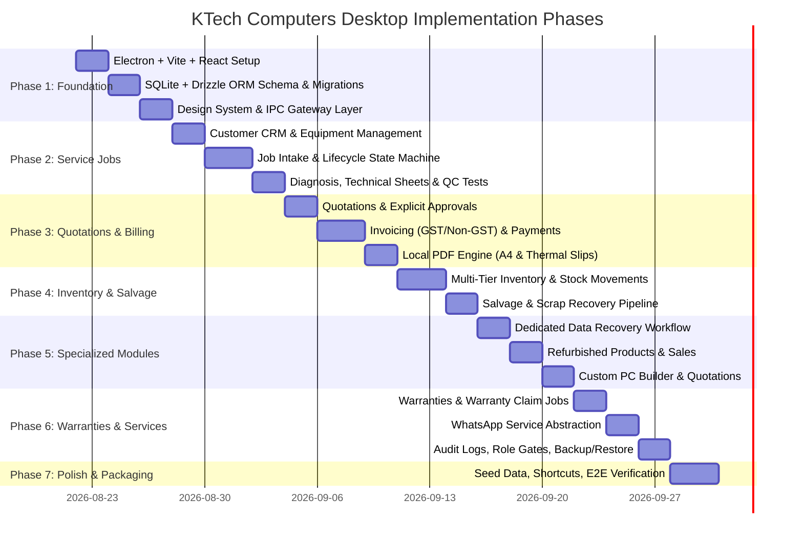

# KTech Computers - Development Roadmap & Phased Execution

This document outlines the structured 7-phase implementation roadmap for building the KTech Computers internal desktop application.

---

## 1. Phased Execution Overview

---

## 2. Phase-by-Phase Deliverables

### Phase 1: Desktop Shell, Database & Security Foundation
- **Deliverables:**
  - Pinned stable Electron runtime integration with Vite 5 + React 18 (TypeScript).
  - Secure sandbox configuration (`contextIsolation: true`, `nodeIntegration: false`, typed `preload.ts`).
  - SQLite database initialization with WAL mode, foreign key enforcement, and Drizzle ORM migration runner.
  - Complete 45-table relational schema definition.
  - Role-based authentication & session state (Owner, Reception, Technician, Accounts) with quick PIN switching.
  - Core high-density CSS design system and tokens (Dark & Light modes).
- **Verification:** Unit tests for schema migrations, IPC security validation, and role authorization gates.

### Phase 2: Customer CRM, Equipment Intake & Service Job Lifecycle
- **Deliverables:**
  - Customer directory with instant search (phone, name, GSTIN).
  - Generic Equipment model (18 distinct device categories: Laptops, Desktops, Consoles, Motherboards, SMPS, Storage, etc.).
  - Rapid multi-step intake modal with accessory checklists and condition inspection logs.
  - 13-stage deterministic Service Job state machine with transition guard rules.
  - Technician diagnostic sheet (voltage checks, IC identification, root cause, repair activity log).
  - Hardware QC test checklist (Boot, Display, Wi-Fi, Audio, Battery, Stress test).
- **Verification:** Create full service jobs across laptops, consoles, and SMPS; transition through all state paths; verify transition history logging.

### Phase 3: Quotations, Explicit Approvals, Billing & Local PDF Engine
- **Deliverables:**
  - Quotation creator with split parts and labor charges.
  - Explicit customer approval capture (Status, Amount, Method: WhatsApp/Phone/In-Person, Employee, Timestamp).
  - Configurable Tax Engine (GST enabled/disabled, CGST/SGST/IGST, custom HSN/SAC codes).
  - Invoicing with advance deposit adjustment, split payments (Cash, UPI QR, Card), and balance tracking.
  - Local A4 PDF generator (Tax Invoices, Quotations, Job Slips, Delivery Acknowledgements).
  - 80mm / 58mm Thermal Receipt formatter for fast counter slips.
- **Verification:** Generate GST and non-GST invoices, test advance deductions, and render high-resolution A4 PDFs locally.

### Phase 4: Multi-Tier Inventory & Salvage Dismantling Engine
- **Deliverables:**
  - Inventory master: New parts, Used parts, Salvaged parts, Finished goods, Consumables.
  - Transactional stock movements (Purchase In, Job Consumption, Direct Sale, Defective Scrap, Adjustments).
  - Auto-deduction upon job completion with zero-negative-stock safeguards.
  - Salvage pipeline: Convert unrepairable devices (`SALV-XXXXX`), harvest tested working parts, and restock with source lineage.
- **Verification:** Simulate stock depletion, salvage dismantling, and verify transaction audit trails.

### Phase 5: Specialized Business Modules
- **Deliverables:**
  - **Data Recovery Studio:** Dedicated 10-stage state machine, storage health diagnostics, recovery complexity levels, destination media tracking, and legal risk disclaimer acknowledgments.
  - **Refurbished Product Sales:** Refurbished equipment lifecycle (`IN_STOCK` $\rightarrow$ `SOLD`), specs grading, acquisition vs selling margins, and direct retail sales.
  - **Custom PC Builder:** Interactive slot-based rig configurator (CPU, GPU, RAM, PSU, etc.), real-time profit margin calculator, and A4 proposal generation.
- **Verification:** Execute end-to-end data recovery triage, configure a custom gaming PC quotation, and sell a refurbished laptop.

### Phase 6: Warranties, WhatsApp Abstraction, Audit & Backups
- **Deliverables:**
  - First-class Warranty entity generation linked to invoices/jobs.
  - 1-Click "Create Warranty Claim Job" linking back to original repair.
  - Abstracted `IWhatsAppService` with Cloud API provider and Web/Desktop deep-link fallback.
  - Immutable Audit Log recording all sensitive mutations.
  - Multi-tier Backup & Restore center with automated snapshots and pre-restore safety backups.
- **Verification:** File a warranty claim on an existing job, test WhatsApp dispatch & fallback, perform a database backup and restore test.

### Phase 7: Production Polish, Realistic Seed Data & Packaging
- **Deliverables:**
  - Pre-loaded comprehensive demo data for KTech Computers across all modules.
  - 1-Click "Reset / Clear Demo Data" option in Settings.
  - Universal keyboard shortcuts (`Ctrl+K`, `F1`-`F4`, `Ctrl+P`, `Esc`).
  - Production packaging for Windows (`.exe` installer / portable).
- **Verification:** Full end-to-end walkthrough of all workflows on a clean test environment.
