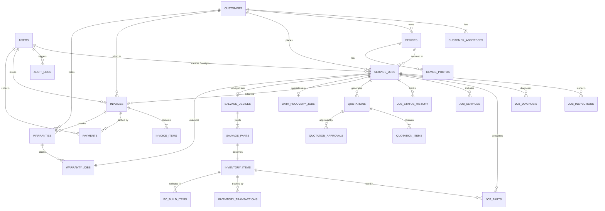
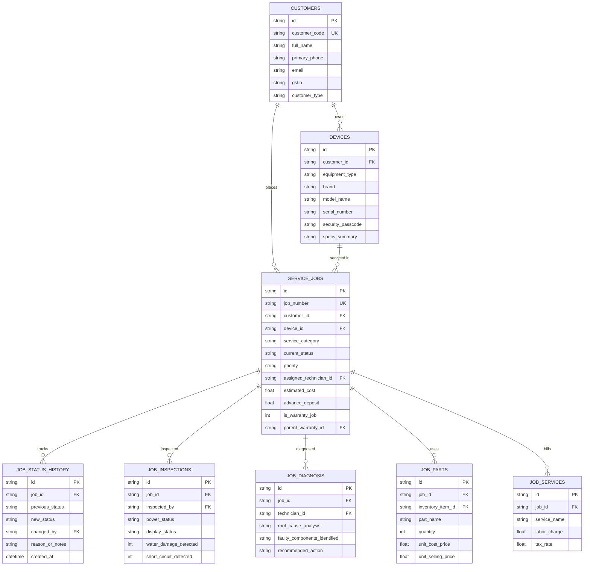
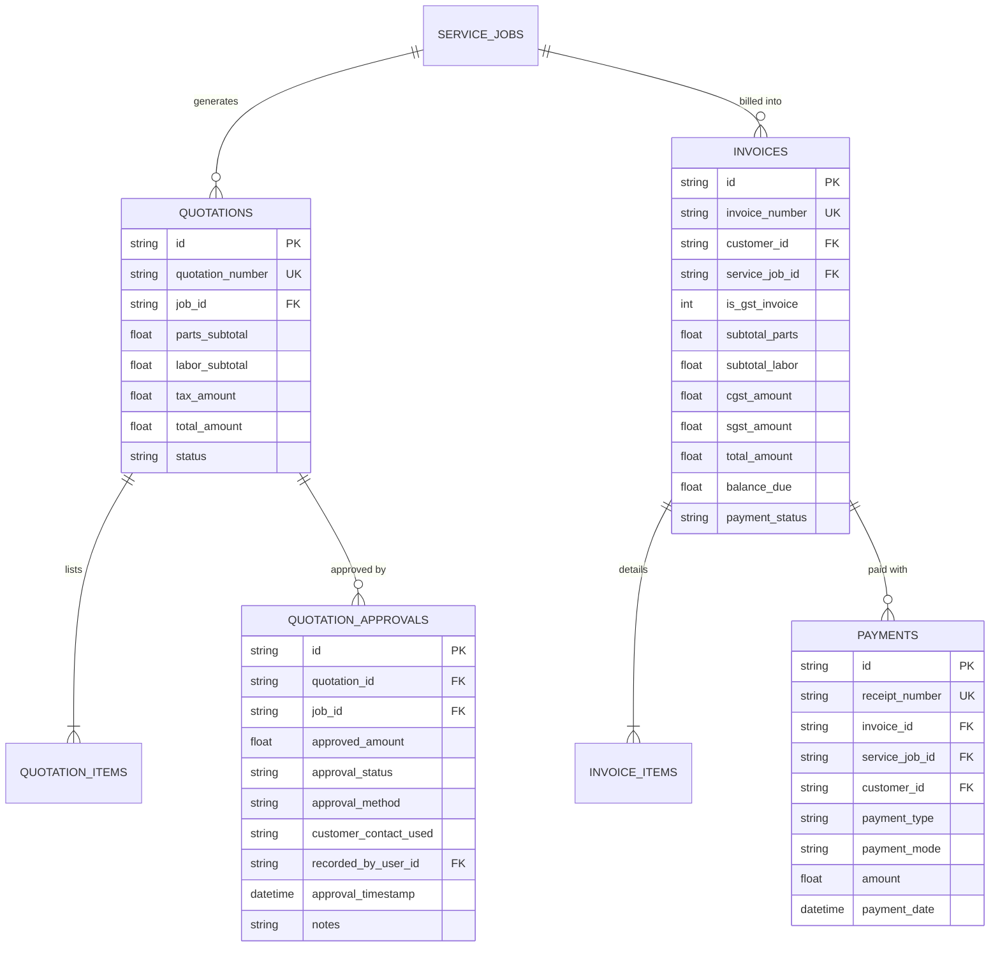
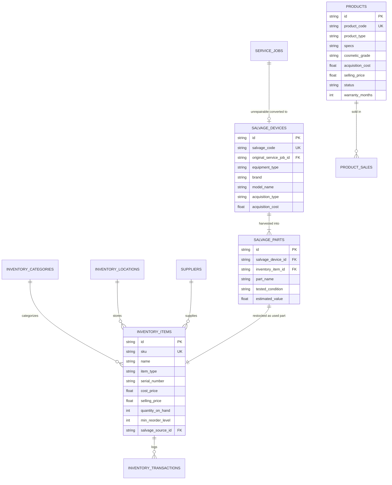
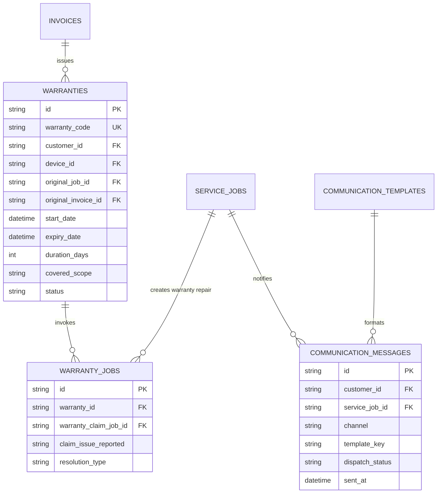

# KTech Computers - Entity Relationship (ER) Diagrams

This document visualizes the complete relational data architecture of the KTech Computers internal desktop application across all 10 domain subsystems.

---

## 1. High-Level Subsystems Overview

---

## 2. Core Service Job & Diagnostics ERD

---

## 3. Quotations, Customer Approvals & Invoicing ERD

---

## 4. Inventory, Salvage & Refurbished Products ERD

---

## 5. Warranties & Communications ERD

