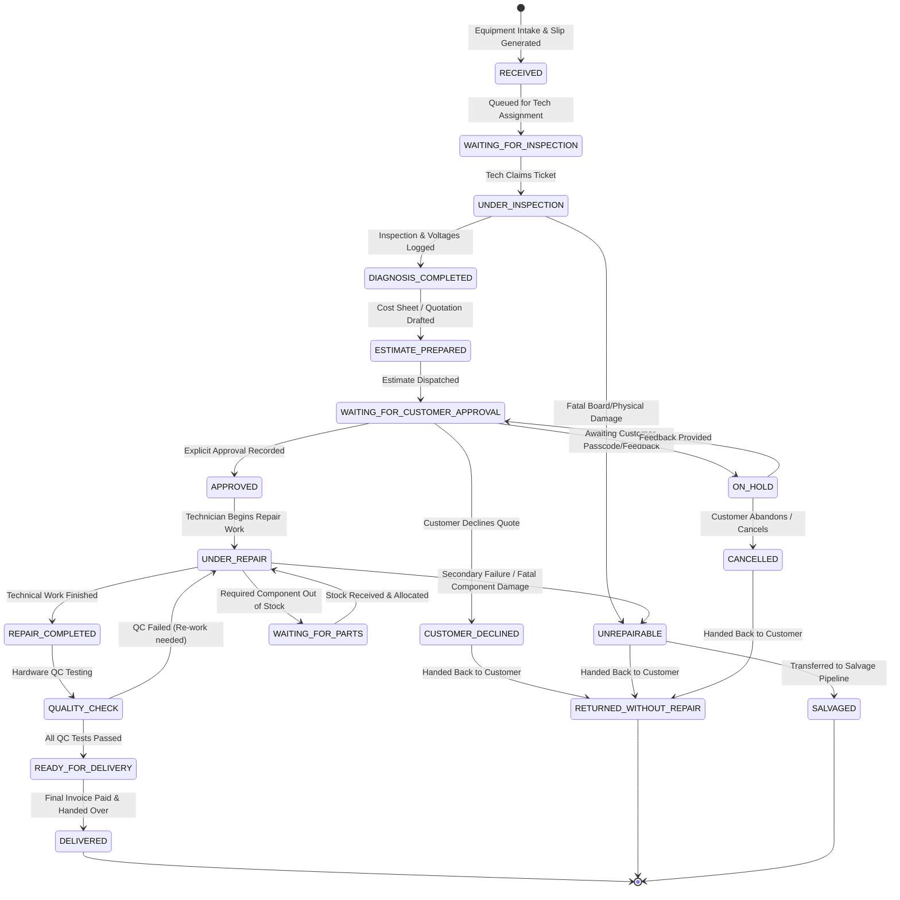
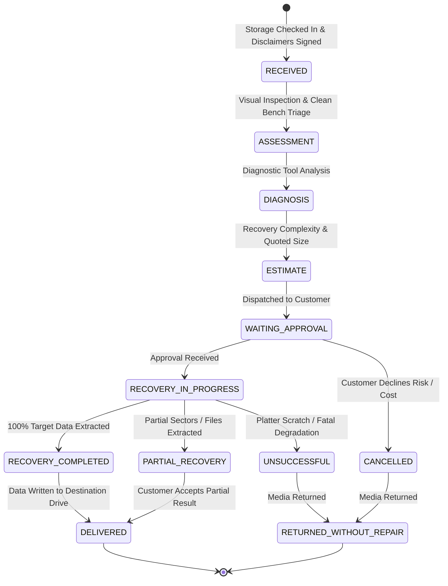
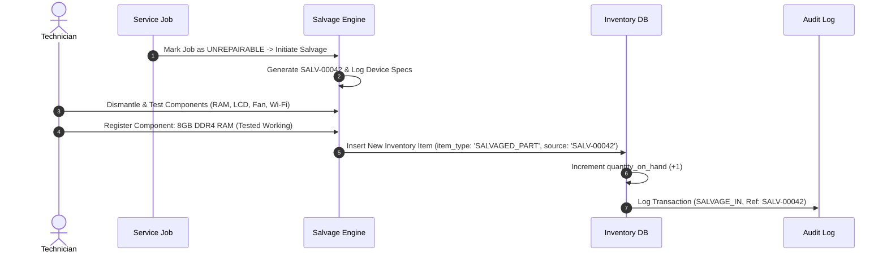
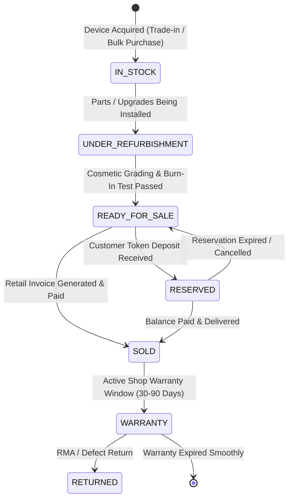
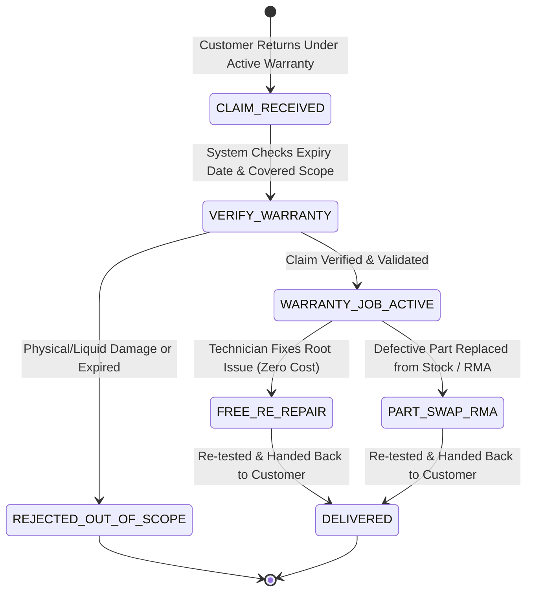

# KTech Computers - Workflow State Machines & Transition Rules

This document specifies the exact deterministic finite state machines, transition guards, side effects, and audit mechanisms governing service jobs, data recovery, refurbished sales, salvage, and warranty claims.

---

## 1. General Service Job State Machine (13 Primary States + 5 Alternatives)

### 1.1 State Transition Matrix & Guard Rules

| From State | To State | Allowed Roles | Guard Conditions / Required Inputs | Side Effects & Actions |
| :--- | :--- | :--- | :--- | :--- |
| `[*] (New)` | `RECEIVED` | Reception, Owner | Device & Customer info entered, condition & accessory checklist completed. | Generates `JOB-YYYY-XXXXX`, creates initial `job_status_history` row, dispatches WhatsApp intake slip. |
| `RECEIVED` | `WAITING_FOR_INSPECTION` | Reception, Tech, Owner | Default queue state or technician assigned. | Ticket appears in technician inspection pool. |
| `WAITING_FOR_INSPECTION`| `UNDER_INSPECTION` | Tech, Owner | `assigned_technician_id` must be assigned. | Locks ticket to tech; starts inspection timer. |
| `UNDER_INSPECTION` | `DIAGNOSIS_COMPLETED` | Tech, Owner | `job_inspections` record and `job_diagnosis` findings logged. | Generates technical diagnostic summary. |
| `DIAGNOSIS_COMPLETED` | `ESTIMATE_PREPARED` | Reception, Tech, Owner | Parts and labor items added to `quotations`. | Generates `EST-YYYY-XXXXX` draft quotation. |
| `ESTIMATE_PREPARED` | `WAITING_FOR_CUSTOMER_APPROVAL` | Reception, Owner | Quotation sent via WhatsApp or handed in person. | Dispatches WhatsApp estimate template; starts approval tracking. |
| `WAITING_FOR_CUSTOMER_APPROVAL` | `APPROVED` | Reception, Owner | `quotation_approvals` record created with method, amount, employee, and timestamp. | Reserves required inventory items; moves job to technician active queue. |
| `WAITING_FOR_CUSTOMER_APPROVAL` | `CUSTOMER_DECLINED` | Reception, Owner | Rejection reason recorded in approval record. | Releases reserved inventory; prompts for diagnostic fee collection. |
| `WAITING_FOR_CUSTOMER_APPROVAL` | `ON_HOLD` | Reception, Tech, Owner | Hold reason recorded (e.g. waiting for customer password / decision). | Pauses SLA timers. |
| `APPROVED` | `UNDER_REPAIR` | Tech, Owner | Technician acknowledges job commencement. | Logs activity timestamp. |
| `UNDER_REPAIR` | `WAITING_FOR_PARTS` | Tech, Owner | Unfulfilled inventory item linked; note entered. | Triggers low-stock / procurement alert for Reception/Owner; sends WhatsApp status update. |
| `WAITING_FOR_PARTS` | `UNDER_REPAIR` | Tech, Reception, Owner | Stock entered into inventory and allocated to job. | Resumes repair timer. |
| `UNDER_REPAIR` | `REPAIR_COMPLETED` | Tech, Owner | Repair activity logged; parts marked as consumed. | Deducts parts from inventory permanently. |
| `REPAIR_COMPLETED` | `QUALITY_CHECK` | Tech, Reception, Owner | QC checklist initialized. | Test items displayed (Boot, Display, Wi-Fi, Sound, Stress). |
| `QUALITY_CHECK` | `READY_FOR_DELIVERY` | Tech, Reception, Owner | Mandatory QC test items passed. | Dispatches WhatsApp ready-for-pickup notice with balance due. |
| `QUALITY_CHECK` | `UNDER_REPAIR` | Tech, Owner | QC item failed; failure notes logged. | Re-opens repair activity with defect explanation. |
| `READY_FOR_DELIVERY` | `DELIVERED` | Reception, Accounts, Owner | Balance payment settled or authorized, delivery acknowledgement signed. | Generates final Tax Invoice `INV-YYYY-XXXXX`, creates `warranties` record, sends WhatsApp payment confirmation. |
| `UNDER_INSPECTION` / `UNDER_REPAIR` | `UNREPAIRABLE` | Tech, Owner | Comprehensive technical failure report logged. | Unlocks options: "Return to Customer" or "Transfer to Salvage". |
| `UNREPAIRABLE` | `SALVAGED` | Owner, Tech | Customer scrap donation agreement or purchase logged. | Creates `SALV-XXXXX` record; opens Salvage Dismantling Engine. |

---

## 2. Dedicated Data Recovery State Machine

---

## 3. Salvage & Inventory Restocking Workflow

---

## 4. Refurbished Product Sales Lifecycle

---

## 5. Warranty Claim State Machine

